<style>
table, th, td {
  border: 1px solid black;
  padding: 4px;
  border-collapse: collapse;
  
  }
</style>

# CMSC 115 Week 2 Lab


## Learning Objectives

- Declare, initialize, and update variables.
- Use the Eclipse debugger to control the current line of execution and visualize variables in memory.
- Use a `Scanner`  to read user input.
- Use numeric operators in calculations.
- Use augmented assignment operators.
- Perform numeric conversion.
- Fix a program that contains syntax errors.
- Debug and fix a program that contains logic errors.

## Setup

TODO: Instructions on how to configure debugger to prevent stepping into java.* methods, etc.

- Eclipse/settings/Java/Debug/Step Filtering
- Select all, Apply and close, restart eclipse.

## Task 1 - Paycheck.java

Double click on `Paycheck.java` in the Package Explorer to open the file in the editor.   


```java
/**
 * Paycheck class - debugging sample to demonstrate variables in memory
 * @author First Last
 */
public class Paycheck {

	public static void main(String[] args) {
		//Declare and initialize variables
		double hourlyRate = 18.25;
		int hoursWorked = 35;
		double pay = hoursWorked * hourlyRate;
		
		//Print initial values
		System.out.println("Week#1 hours: " + hoursWorked + " rate: $" + hourlyRate + " pay: $" + pay);
		
		//Assign hoursWorked to 39, recalculate pay
		hoursWorked = 39;
		pay = hoursWorked * hourlyRate;
		
		//Print updated values
		System.out.println("Week#2 hours: " + hoursWorked + " rate: $" + hourlyRate + " pay: $" + pay);
				
		//TODO: Week 3 - Assign hoursWorked to 27, increase hourlyRate by 0.50, recalculate pay
		
		//TODO: Print updated values
				
	}

}
```


Execute the program and view the output.  

1. Click `Paycheck.java` in the Package Explorer to select the file.
2. Click the run button on the workbench toolbar. 
3. View the program output in the console window.

```text
Week#1 hours: 35 rate: $18.25 pay: $638.75
Week#2 hours: 39 rate: $18.25 pay: $711.75
```

A **variable** is a name associated with a memory location. A **variable declaration** specifies a data type such as `int` or `double`, along with the name.  Once a variable is declared, it can be assigned an initial value.  The declaration and initialization can be done in one statement or two as shown below. 

<table>
<tr>
<th>One Statement</th>
<th>Two Statements</th>
</tr>
<tr>
<td>int hoursWorked = 35; //declare and initialize</td>
<td>int hoursWorked; &nbsp; &nbsp;//declare<br>hoursWorked = 35; //initialize</td>
</tr>
</table>

A variable is declared and initialized only once within a method.  However, it can be updated and assigned a new value several times.
 
Let's use the Eclipse debugger to step through the program one line of code at a time. Debugging helps you visualize how variables are declared, initialized, and updated in memory.

<table>

<tr>
<td>
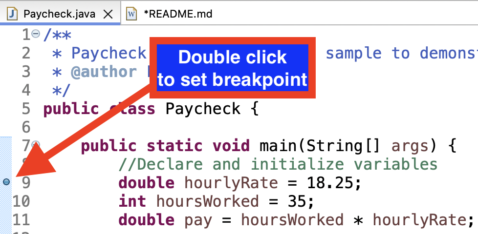
</td>
<td>
Set a breakpoint at line 9 by double clicking in the gutter to the left of the line number.  A breakpoint is indicated by a small circle.  You can remove a breakpoint by double clicking on it.
</td>
</tr>

<tr>
<td>
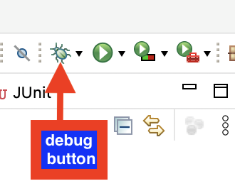
</td>
<td>
Click the debug button on the menubar. Confirm switching to the debug perspective if prompted.
</td>
</tr>
</table>

Eclipse switches to the debug perspective. The main method is called and stops execution at the breakpoint, i.e. line 9.  


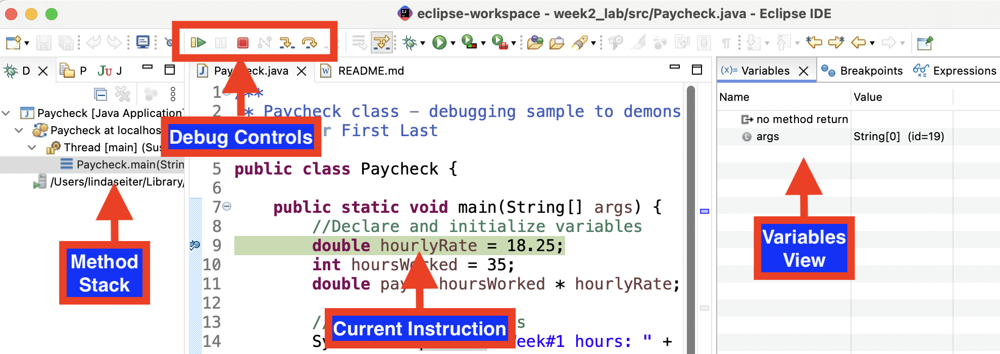

- The stack shows the `main` method is the current method under execution.
- Line 9 is highlighted and there is an arrow in the gutter, indicating the current line of execution.
- The **variables view** will display the variables stored in memory for the current method.
- The menubar displays new buttons for debugging.


Let's use the "step over" button to execute one line of code at a time and observe how each statement impacts the variables stored in memory.

<table>

<tr>
<th>
Step Over
</th>
<th>
Current line
</th>
<th>
Variables View
</th>
</tr>


<tr>
<td>
Click "Step Over" button to execute the current line of code<br>
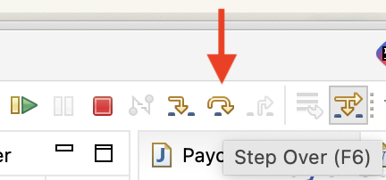
</td>
<td>
<code>double hourlyRate = 18.25;</code>
</td>
<td>
<code>hourlyRate</code> is allocated and initialized in memory

</td>
</tr>

<tr>
<td>
</td>
<td>
<code>int hoursWorked = 35;</code></td>
<td>
<code>hoursWorked</code> is allocated and initialized in memory
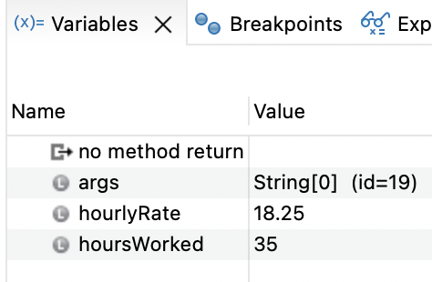
</td>
</tr>

<tr>
<td>
</td>
<td>
<code>double pay = hoursWorked * hourlyRate;</code></td>
<td>
<code>pay</code> is allocated and initialized in memory<br>
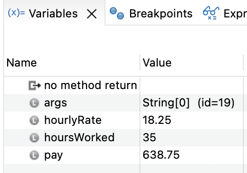
</td>
</tr>

<tr>
<td>
</td>
<td>
<code>System.out.println("Week#1 hours: " + hoursWorked + " rate: $" + hourlyRate + " pay: $" + pay);</code></td>
<td>
Variables accessed from memory and printed to console
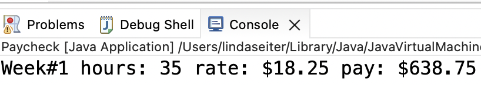
</td>
</tr>

<tr>
<td>
</td>
<td>
<code>hoursWorked = 39;</code></td>
<td>
<code>hoursWorked</code> updated in memory
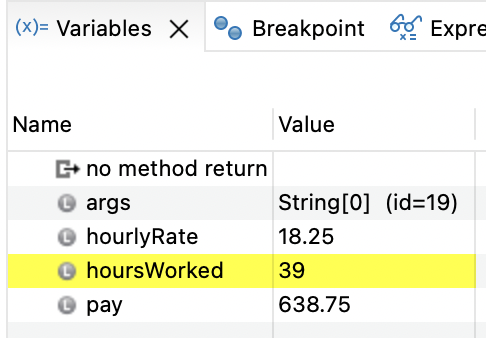
</td>
</tr>

<tr>
<td>
</td>
<td>
<code>pay = hoursWorked * hourlyRate;</code></td>
<td>
<code>pay</code> updated in memory
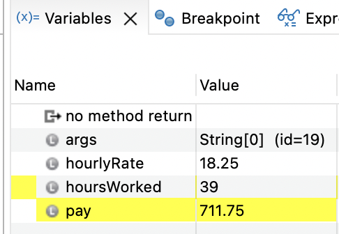
</td>
</tr>

<tr>
<td>
</td>
<td>
<code>
System.out.println("Week#2 hours: " + hoursWorked + " rate: $" + hourlyRate + " pay: $" + pay);</code></td>
<td>
Variables accessed from memory and printed to console
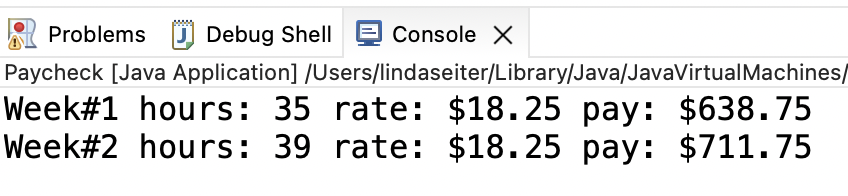
</td>
</tr>

<tr>
<td>
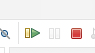
</td>
<td colspan="2">
We've reached the end of the main method.  Press the red square to terminate the debug session.
</td>
</tr>

<tr>
<td>
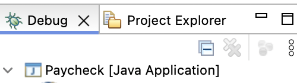
</td>
<td colspan="2">
Close the debug tab and return to the project explorer.
</td>
</tr>
</table>

Now that you've seen how variables are initialized and updated in memory,
add statements to update  `hoursWorked` and `hourlyRate` and recalculate `pay` for week#3, then print the updated variable values:

```text
Week#1 hours: 35 rate: $18.25 pay: $638.75
Week#2 hours: 39 rate: $18.25 pay: $711.75
Week#3 hours: 27 rate: $18.75 pay: $506.25
```

 
1. Select `Paycheck.java` and click the green run button to execute the code and view the output. 
2. Select `PaycheckTest.java` and click the green run button to run the Junit test and confirm your solution passes the test.  

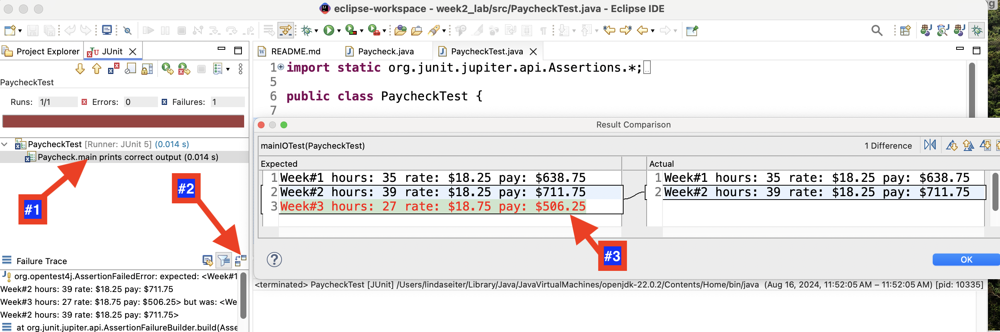

If the Junit test fails:

1. Click on the failed test.
2. Click the "Compare Actual With Expected Test Result" button.
3. View the test results.
4. Fix `Paycheck.java` and rerun `PaycheckTest.java`.

Save and close any open files.


NOTE: Aside from visualizing variables in memory, you can use the debugger to step through your code to find logic errors.  Debugging is **one of the most useful skills** you can develop as a software developer!


## Task 2 - StudentInfo.java

Double click on `StudentInfo.java` in the Package Explorer to open the file in the editor, then run the program to view the output. 


```java
/**
 * StudentIfno class demonstrates an error in redeclaring a variable.  
 * @author First Last
 */
public class StudentInfo {

	public static void main(String[] args) {
		//Variable declaration and initialization
		double gpa = 3.8;
				
		//Variable declaration
		int age;
		//Variable initialization
		age = 28;
		
		//Print initial values
		System.out.println("Age: " + age + " gpa: " + gpa);
		
		//Update age to 29
		age = 29;
		
		//TODO: Fix the error and update gpa to 4.0.
		//double gpa = 4.0;
		
		//Print updated values
		System.out.println("Age: " + age + " gpa: " + gpa);	

	}

}
```


<table>
<tr>
<th>Expected Output</th>
<th>Actual Output</th>
</tr>
<tr>
<td>Age: 28 gpa: 3.8<br>
Age: 29 gpa: 4.0</td>
<td>Age: 28 gpa: 3.8<br>
Age: 29 gpa: 3.8</td>
</tr>
</table>

After updating `age` to 29, the code should update `gpa` to 4.0.  

<table>

<tr>
<td>
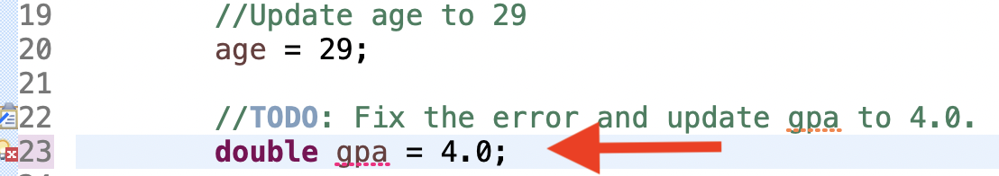
</td>
<td>
Remove the comment character on line 23. 
</td>
</tr>

<tr>
<td>
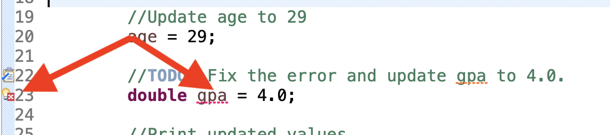
</td>
<td>
Notice there is a red error icon in the gutter on line 23.  The variable <code>gpa</code> is also underlined in red.
</td>
</tr>

<tr>
<td>
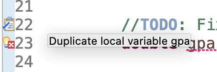
</td>
<td>
Hover the mouse over the red error icon. A message "Duplicate local variable gpa" should appear. The <code>gpa</code> variable was already declared on line 9 and can't be redeclared on line 23.
</td>
</tr>

<tr>
<td>
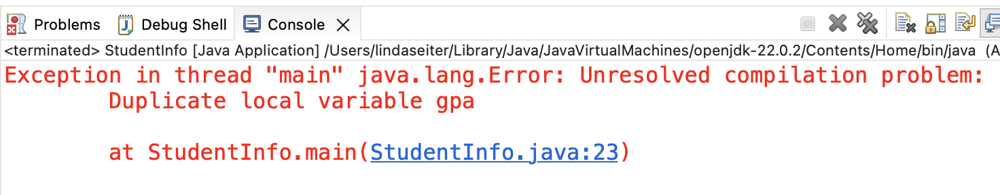
</td>
<td>
If you try to run <code>StudentInfo.java</code>, you'll see an error message in the console indicating the program bombed due to the compilation problem.
</td>
</tr>

</table>

Let's fix the error.  Line 23 should assign `gpa` to 4.0 **without** redeclaring the variable.  

1. Remove the type `double` on line 23 to prevent a duplicate variable declaration. The compiler errors should go away.
2. Run `StudentInfo` to view the output.
3. Run `StudentInfoTest` to confirm your solution passes the two Junit tests:
	- One test checks the expected output. The other test counts the number of times `gpa` is declared, which should be just once.

Save and close any open files.  
