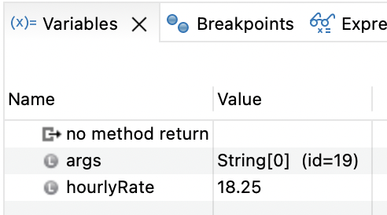

<style>
table, th, td {
  border: 1px solid black;
  padding: 4px;
  border-collapse: collapse;
  
  }
</style>

# CMSC 115 Week 2 Lab


## Learning Objectives

- Declare, initialize, and update variables.
- Use the Eclipse debugger to control the current line of execution and visualize variables in memory.
- Use a `Scanner`  to read user input.
- Use numeric operators in calculations.
- Use augmented assignment operators.
- Perform numeric conversion.
- Fix a program that contains syntax errors.
- Debug and fix a program that contains logic errors.

## Setup

TODO: Instructions on how to configure debugger to prevent stepping into java.* methods, etc.

- Eclipse/settings/Java/Debug/Step Filtering
- Select all, Apply and close, restart eclipse.

## Reset or Switch Perspectives

In this lab you will learn how to use the Java debugger.  The Debug perspective provides a different layout than the Java perspective.

While you are doing the lab tasks, keep in mind how to restore a perspective or switch perspective:

- Restore a perspective to its original layout by *Window > Perspective > Reset Perspective*
- Switch to the Java Perspective by *Window > Perspective > Open Perspective > Java*

## Task 1 - Paycheck.java

Double click on `Paycheck.java` in the Package Explorer to open the file in the editor.   


```java
/**
 * Paycheck class - debugging sample to demonstrate variables in memory
 * @author First Last
 */
public class Paycheck {

	public static void main(String[] args) {
		//Declare and initialize variables
		double hourlyRate = 18.25;
		int hoursWorked = 35;
		double pay = hoursWorked * hourlyRate;
		
		//Print initial values
		System.out.println("Week#1 hours: " + hoursWorked + " rate: $" + hourlyRate + " pay: $" + pay);
		
		//Assign hoursWorked to 39, recalculate pay
		hoursWorked = 39;
		pay = hoursWorked * hourlyRate;
		
		//Print updated values
		System.out.println("Week#2 hours: " + hoursWorked + " rate: $" + hourlyRate + " pay: $" + pay);
				
		//TODO: Week 3 - Assign hoursWorked to 27, increase hourlyRate by 0.50, recalculate pay
		
		//TODO: Print updated values
				
	}

}
```


Execute the program and view the output.  

1. Click `Paycheck.java` in the Package Explorer to select the file.
2. Click the run button on the workbench toolbar. 
3. View the program output in the console window.

```text
Week#1 hours: 35 rate: $18.25 pay: $638.75
Week#2 hours: 39 rate: $18.25 pay: $711.75
```

- A **variable** is a name associated with a memory location. 
- A **variable declaration** allocates memory to store a value.  

Each variable declaration must specify a data type such as `int` or `double`, along with the variable name.  Once a variable is declared, it can be assigned an initial value.  The declaration and initialization can be done in one statement or two as shown below. 

<table>
<tr>
<th>One Statement</th>
<th>Two Statements</th>
</tr>
<tr>
<td>int hoursWorked = 35; //declare and initialize</td>
<td>int hoursWorked; &nbsp; &nbsp;//declare<br>hoursWorked = 35; //initialize</td>
</tr>
</table>

A variable is declared only once within a block such as a method body.  However, it can be assigned a value several times.
 
Let's use the Eclipse debugger to step through the program one line of code at a time. Debugging helps to visualize how variables are declared, initialized, and updated in memory.

<table>

<tr>
<td>

</td>
<td>
Set a breakpoint at line 9 by double clicking in the gutter to the left of the line number.  A breakpoint is indicated by a small circle.  You can remove a breakpoint by double clicking on it.
</td>
</tr>

<tr>
<td>

</td>
<td>
Click the debug button on the menubar. Confirm switching to the debug perspective if prompted.
</td>
</tr>
</table>

Eclipse switches to the debug perspective. The main method is called and stops execution at the breakpoint, i.e. line 9.  


- The stack shows the `main` method is the current method under execution.
- Line 9 is highlighted and there is an arrow in the gutter, indicating the current line of execution.
- The **variables view** will display the variables stored in memory for the current method.
- The menubar displays new buttons for debugging.


Let's use the "step over" button to execute one line of code at a time and observe how each statement impacts the variables stored in memory.

<table>

<tr>
<th>
Step Over
</th>
<th>
Current line
</th>
<th>
Variables View
</th>
</tr>


<tr>
<td>
Click "Step Over" button to execute the current line of code<br>

</td>
<td>
<code>double hourlyRate = 18.25;</code>
</td>
<td>
<code>hourlyRate</code> is allocated and initialized in memory

</td>
</tr>

<tr>
<td>
</td>
<td>
<code>int hoursWorked = 35;</code></td>
<td>
<code>hoursWorked</code> is allocated and initialized in memory

</td>
</tr>

<tr>
<td>
</td>
<td>
<code>double pay = hoursWorked * hourlyRate;</code></td>
<td>
<code>pay</code> is allocated and initialized in memory<br>

</td>
</tr>

<tr>
<td>
</td>
<td>
<code>System.out.println("Week#1 hours: " + hoursWorked + " rate: $" + hourlyRate + " pay: $" + pay);</code></td>
<td>
Variables accessed from memory and printed to console

</td>
</tr>

<tr>
<td>
</td>
<td>
<code>hoursWorked = 39;</code></td>
<td>
<code>hoursWorked</code> updated in memory

</td>
</tr>

<tr>
<td>
</td>
<td>
<code>pay = hoursWorked * hourlyRate;</code></td>
<td>
<code>pay</code> updated in memory

</td>
</tr>

<tr>
<td>
</td>
<td>
<code>
System.out.println("Week#2 hours: " + hoursWorked + " rate: $" + hourlyRate + " pay: $" + pay);</code></td>
<td>
Variables accessed from memory and printed to console

</td>
</tr>

<tr>
<td>

</td>
<td colspan="2">
We've reached the end of the main method.  Press the red square to terminate the debug session.
</td>
</tr>

<tr>
<td>

</td>
<td colspan="2">
Close the debug tab and return to the project explorer.
</td>
</tr>
</table>

Now that you've seen how variables are initialized and updated in memory, add statements to update `hoursWorked` and `hourlyRate` and recalculate `pay` for week#3, then print the updated variable values:

```text
Week#1 hours: 35 rate: $18.25 pay: $638.75
Week#2 hours: 39 rate: $18.25 pay: $711.75
Week#3 hours: 27 rate: $18.75 pay: $506.25
```

 
1. Select `Paycheck.java` and click the green run button to execute the code and view the output. 
2. Select `PaycheckTest.java` and click the green run button to run the Junit test and confirm your solution passes the test.  


If the Junit test fails:

1. Click on the failed test.
2. Click the "Compare Actual With Expected Test Result" button.
3. View the test results.
4. Fix `Paycheck.java` and rerun `PaycheckTest.java`.

Save and close any open files.


NOTE: Aside from visualizing variables in memory, you can use the debugger to step through your code to find logic errors.  Debugging is **one of the most useful skills** you can develop as a software developer!


## Task 2 - PizzaShares.java

Double click on `PizzaShares.java` in the Package Explorer to open the file in the editor. 

```java
import java.util.Scanner;

/**
 * PizzaShares class demonstrates user input, along with division and remainder operators 
 * @author First Last
 */
public class PizzaShares {
	
	public static void main(String[] args) {
		//Declare local variables
		int people, totalSlices, slicesPerPerson, slicesRemaining;
		
		//Declare and initialize Scanner to read user input
		Scanner input = new Scanner(System.in);    
		
		//Prompt for number of pizza slices and number of people
		System.out.print("Enter #slices and #people: ");
		totalSlices = input.nextInt();
		people = input.nextInt();
		
		//Compute number of slices per person
		slicesPerPerson = totalSlices / people;
		
		System.out.println("Each person gets " + slicesPerPerson + " slices.");
		
		//TODO: Compute and print number of slices remaining
		
	}

}
```

The program uses a `Scanner` to read user input and initialize the
 `totalSlices` and `people` variables.  The `slicesPerPerson` variable stores the number of whole slices per person. 
 
Run `PizzaShares`, entering the sample input displayed in bold:
 
<table>
<tr>
<th>Sample Run</th>
</tr>
<tr>
<td>Enter #slices and #people: <b>24 10</b><br>
Each person gets 2 slices.</td>
</tr>
</table>

Given 24 slices and 10 people, each person gets 2 slices.  How many slices are leftover?  


<table>
<tr><td>Operator</td><td>Meaning</td><td>Expression</td><td>Value</td></tr>
<tr><td>+</td><td>addition</td><td>5+3</td><td>8</td></tr>
<tr><td>-</td><td>subtraction</td><td>8-2</td><td>6</td></tr>
<tr><td>*</td><td>multiplication</td><td>4*5</td><td>20</td> </tr>
<tr><td>/</td><td>division</td><td>17/3</td><td>5</td> </tr>
<tr><td>%</td><td>remainder</td><td>17%3</td><td>2</td> </tr>
</table>


 </tr>
</table>


1. Update the program to use Java's modulo (remainder) operator to calculate and print the leftover slices as shown in the sample runs tomorrow. 
2. Run `PizzaSharesTest.java` to confirm your solution passes the Junit tests.

<table>
<tr>
<th>Sample Run#1</th><th>Sample Run#2</th>
</tr>
<tr>
<td>Enter #slices and #people: <b>24 10</b><br>
Each person gets 2 slices.<br>
There are 4 slices remaining.</td>
<td>Enter #slices and #people: <b>12 4</b><br>
Each person gets 3 slices.<br>
There are 0 slices remaining.</td>
</tr>
</table>


## Task 3 - StudentInfo.java

Double click on `StudentInfo.java` in the Package Explorer to open the file in the editor, then run the program to view the output. 


```java
/**
 * StudentIfno class demonstrates an error in redeclaring a variable.  
 * @author First Last
 */
public class StudentInfo {

	public static void main(String[] args) {
		//Variable declaration and initialization
		double gpa = 3.8;
				
		//Variable declaration
		int age;
		//Variable initialization
		age = 28;
		
		//Print initial values
		System.out.println("Age: " + age + " gpa: " + gpa);
		
		//Update age to 29
		age = 29;
		
		//TODO: Fix the error and update gpa to 4.0.
		//double gpa = 4.0;
		
		//Print updated values
		System.out.println("Age: " + age + " gpa: " + gpa);	

	}

}
```


<table>
<tr>
<th>Expected Output</th>
<th>Actual Output</th>
</tr>
<tr>
<td>Age: 28 gpa: 3.8<br>
Age: 29 gpa: 4.0</td>
<td>Age: 28 gpa: 3.8<br>
Age: 29 gpa: 3.8</td>
</tr>
</table>

After updating `age` to 29, the code should update `gpa` to 4.0.    The line to reassign `gpa` to 4.0 is currently commented out. 

<table>

<tr>
<td>

</td>
<td>
Remove the comment character on line 23. 
</td>
</tr>

<tr>
<td>

</td>
<td>
Notice there is a red error icon in the gutter on line 23.  The variable <code>gpa</code> is also underlined in red.
</td>
</tr>

<tr>
<td>

</td>
<td>
Hover the mouse over the red error icon. A message "Duplicate local variable gpa" should appear. The <code>gpa</code> variable was already declared on line 9 and can't be redeclared on line 23.
</td>
</tr>

<tr>
<td>

</td>
<td>
If you try to run <code>StudentInfo.java</code>, you'll see an error message in the console indicating the program bombed due to the compilation problem.
</td>
</tr>

</table>

Let's fix the error.  Line 23 should assign `gpa` to 4.0 **without** redeclaring the variable.  

1. Remove the type `double` on line 23 to prevent a duplicate variable declaration. The compiler errors should go away.
2. Run `StudentInfo` to view the output.
3. Run `StudentInfoTest` to confirm your solution passes the two Junit tests:
	- One test checks the expected output. The other test counts the number of times `gpa` is declared, which should be just once.

Save and close any open files.  

## Task 4 - BusRoute.java

Java has increment and decrement operators:

<table>
<tr><td>Operator</td><td>Expression</td><td>Equivalent</td></tr>
<tr><td>++</td><td>x++</td><td>x = x + 1</td></tr>
<tr><td>--</td><td>x--</td><td>x = x - 1</td></tr>
</table>

Java also supports augmented assignment operators:

<table>
<tr><td>Operator</td><td>Expression</td><td>Equivalent</td></tr>
<tr><td>+=</td><td>x += 5</td><td>x = x + 5</td></tr>
<tr><td>-=</td><td>x -= 5</td><td>x = x - 5</td></tr>
<tr><td>*=</td><td>x *= 5</td><td>x = x * 5</td> </tr>
<tr><td>/=</td><td>x /= 5</td><td>x = x / 5</td> </tr>
<tr><td>%=</td><td>x %/ 5</td><td>x = x % 5</td> </tr>
</table>

Double click on `BusRoute.java` in the Package Explorer to open the file in the editor, then run the program to view the output. 

```java
/**
 * BusRoute class demonstrates augmented assignment operators and increment operator.
 * @author First Last
 */
public class BusRoute {

	public static void main(String[] args) {
		int passengers = 0;
		int busStop = 0;
		System.out.println("Bus begins its route");
		
		//first stop, 8 people get on (addition assignment operator)
		busStop++;
		System.out.println("8 passengers get on at stop#" + busStop);
		passengers += 8;
		System.out.println("Departing stop#" + busStop + " with " + passengers + " passengers");
	
		//next stop, 2 get off (subtraction assignment operator)
		busStop++;
		System.out.println("2 passengers get off at stop#" + busStop);
		passengers -= 2;
		System.out.println("Departing stop#" + busStop + " with " + passengers + " passengers");
		
		//TODO: next stop, half the passengers get off (use division assignment operator)
		
		//TODO: next stop, the number of passengers triples (use multiplication assignment operator)
						
	}
}
```


The program uses the increment operator `++` along with augmented assignment operators `+=` and `-=` to update `busStop` and `passengers`.

<table>
<tr>
<th>Expected Output</th>
<th>Actual Output</th>
</tr>
<tr>
<td>Bus begins its route<br>
8 passengers get on at stop#1<br>
Departing stop#1 with 8 passengers<br>
2 passengers get off at stop#2<br>
Departing stop#2 with 6 passengers<br>
Half the passengers get off at stop#3<br>
Departing stop#3 with 3 passengers<br>
The number of passengers triples at stop#4<br>
Departing stop#4 with 9 passengers</td>
<td>Bus begins its route<br>
8 passengers get on at stop#1<br>
Departing stop#1 with 8 passengers<br>
2 passengers get off at stop#2<br>
Departing stop#2 with 6 passengers<br>
<br><br><br><br></td>
</tr>
</table>

1. Update `BusRoute.java` to add two more bus stops.  Use the appropriate augmented assignment operators to adjust the passenger count.  
	- Half the passengers get off at the 3rd stop.
	- The number of passengers triples at the 4th stop.
2. Run `BusRoute` to view the output.
3. Run `BusRouteTest` to confirm your solution passes the Junit tests.  

## Task 5 - DebugIt.java

Double click on `DebugIt.java` in the Package Explorer to open the file in the editor, then run the program to view the output. 

- Line 12 should increase `planesOnRunway` by 5.
- Line 14 should decrease `planesOnRunway` by 3.


```java
/**
 * DebugIt class demonstrates common operator errors.
 * @author First Last
 */
public class DebugIt {

	//TODO: Fix the operator errors
	public static void main(String[] args) {
		int planesOnRunway = 2;
		
		//5 planes land on runway, increase planesOnRunway by 5
		planesOnRunway =+ 5;   //expected value: 7
		//3 planes take off, decrease planesOnRunway by 3
		planesOnRunway =- 3;   //expected value: 4
		
		System.out.println("Planes on runway = " + planesOnRunway);
	}

}
```

The program has a subtle but common error that prevents it from producing the expected output:


<table>
<tr>
<th>Expected Output</th>
<th>Actual Output</th>
</tr>
<tr>
<td>Planes on runway = 4</td>
<td>Planes on runway = -3</td>
</tr>
</table>


Let's use the debugger to execute each line and view the variables in memory.

<table>

<tr>
<td>

</td>
<td>
Set a breakpoint at line 9 by double clicking in the gutter to the left of the line number. 
</td>
</tr>

<tr>
<td>

</td>
<td>
Click the debug button on the menubar. Confirm switching to the debug perspective if prompted.
</td>
</tr>

<tr>
<td>

</td>
<td>
Eclipse switches to the debug perspective. The main method is called and stops execution at the breakpoint. 
</td>
</tr>
</table>


We'll find the bug using the "step over" button to execute one line of code at a time and view the variable in memory.

<table>

<tr>
<th>
Step Over
</th>
<th>
Current line
</th>
<th>
Variables View
</th>
</tr>


<tr>
<td>

</td>
<td>
<code>int planesOnRunway = 2;</code>
</td>
<td>

</td>
</tr>

<tr>
<td>
</td>
<td>
<code>planesOnRunway =+ 5;</code></td>
<td>

<br>
<br>
Error! The variable should be increased by 5, resulting in the value 7, but it is erroneously assigned to 5.
</td>
</tr>

<tr>
<td>
</td>
<td>
<code>planesOnRunway =- 3;</code></td>
<td>

<br>
<br>
Error! The variable should be decreased by 3, resulting in the value 4, but it is erroneously assigned to -3.
</td>
</tr>

<tr>
<td>
</td>
<td>
<code>System.out.println("Planes on runway = " + planesOnRunway);</code></td>
<td>

<br>
The actual output does not match the expected output.
</td>
</tr>

<tr>
<td>

</td>
<td colspan="2">
We've reached the end of the main method.  Press the red square to terminate the debug session.
</td>
</tr>

<tr>
<td>

</td>
<td colspan="2">
Close the debug tab and return to the project explorer.
</td>
</tr>

</table>

This example demonstrates a common error with augmented assignment operators.


<table>

<tr>
<th>
Current Incorrect Code
</th>
<th>
Equivalent Code
</th>
</tr>

<tr>
<td>
<code>planesOnRunway =+ 5;</code>
</td>
<td>
<code>planesOnRunway = +5;</code>
<br><br>Assign to positive 5.
</td>
</tr>

<tr>
<td>
<code>planesOnRunway =- 3;</code>
</td>
<td>
<code>planesOnRunway = -3;</code>
<br><br>Assign to negative 3.
</td>
</tr>


</table>


Augmented assignment operators requires the math operator to come **before** the equal sign, not after it!

<table>
<tr><td>Operator</td><td>Expression</td><td>Equivalent</td></tr>
<tr><td>+=</td><td>x += 5</td><td>x = x + 5</td></tr>
<tr><td>-=</td><td>x -= 5</td><td>x = x - 5</td></tr>
<tr><td>*=</td><td>x *= 5</td><td>x = x * 5</td> </tr>
<tr><td>/=</td><td>x /= 5</td><td>x = x / 5</td> </tr>
<tr><td>%=</td><td>x %/ 5</td><td>x = x % 5</td> </tr>
</table>


1. Fix `DebugIt.java` to use the correct augmented assignment operators to update `planesOnRunway`.
2. Run `DebugIt` to confirm the expected output.
3. Run `DebugItTest` to confirm the Junit tests pass.

Try to remember this error and how to fix it, it is a very common mistake!


## Task 6 - Rounding.java

Double click on `Rounding.java` in the Package Explorer to open the file in the editor. 

```java

```

Run the program, passing the bold value as input:

<table>
<tr>
<th>Sample Run#1</th>
<th>Sample Run#2</th>
</tr>
<tr>
<td>Enter number: <b>1.9247</b><br>
Cast as int: 1<br>
<br>
Round to nearest int<br>
Original: 	1.9247<br>
Add 0.5:	2.4247<br>
Cast as int:	2<br>
<br>
Truncate to 3 digits after the decimal point<br>
Original:		1.9247<br>
Move . 3 digits right:	1924.7<br>
Cast as int		1924<br>
Move . 3 digits left:	1.924<br>
<br>
TODO: Round to 3 digits after the decimal point
</td>
<td>Enter number: <b>3.2984</b><br>
Cast as int: 3<br>
<br>
Round to nearest int<br>
Original: 	3.2984<br>
Add 0.5:	3.7984<br>
Cast as int:	3<br>
<br>
Truncate to 3 digits after the decimal point<br>
Original:		3.2984<br>
Move . 3 digits right:	3298.4<br>
Cast as int		3298<br>
Move . 3 digits left:	3.298<br>

TODO: Round to 3 digits after the decimal point
</tr>
</table>

- 
